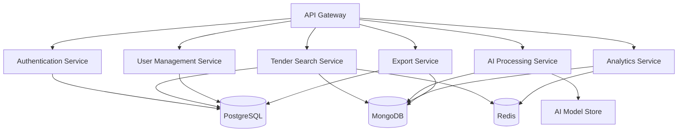

# Tender Insight Hub - Cloud Deployment Architecture

## Overview

This document outlines the cloud deployment architecture for the Tender Insight Hub, a multi-tenant SaaS platform designed for South African SMEs to discover and analyze public tenders. The architecture ensures scalability, security, high availability, and cost-effectiveness while supporting the platform's core requirements.

## Architecture Principles

- **Cloud-Native Design**: Leveraging containerized microservices
- **Multi-Tenant Isolation**: Secure data separation between teams
- **Horizontal Scalability**: Auto-scaling based on demand
- **High Availability**: 99.9% uptime with failover mechanisms
- **Security-First**: Zero-trust security model with encryption at rest and in transit
- **Cost Optimization**: Resource efficiency with usage-based scaling

## Deployment Overview

### Target Cloud Platform: **AWS** (Primary) with Multi-Cloud Ready Design

**Rationale:**
- Comprehensive AI/ML services (SageMaker, Bedrock)
- Strong presence in South Africa (Cape Town region)
- Excellent database managed services
- Cost-effective for startup/SME projects
- Mature container orchestration (EKS)

### Alternative Platforms:
- **Microsoft Azure**: Strong enterprise integration, good South African presence
- **Google Cloud Platform**: Excellent AI/ML tools, competitive pricing

## Core Architecture Components

### 1. Container Orchestration Layer

**Amazon EKS (Elastic Kubernetes Service)**

```yaml
# Cluster Configuration
Cluster Name: tender-insight-hub-prod
Node Groups:
  - General Purpose: t3.medium (2-10 nodes, auto-scaling)
  - AI Workloads: c5.large (1-5 nodes, spot instances)
  - Database: m5.large (dedicated, reserved instances)

Networking:
  - VPC: Custom VPC with private/public subnets
  - Security Groups: Strict ingress/egress rules
  - Load Balancer: Application Load Balancer (ALB)
```

**Key Benefits:**
- Automatic scaling based on CPU/memory metrics
- Rolling deployments with zero downtime
- Service mesh for microservice communication
- Built-in secrets management

### 2. Application Services Architecture

#### 2.1 FastAPI Backend Services

**Microservice Breakdown:**



**Service Specifications:**

| Service | Container Spec | Replicas | Scaling Trigger |
|---------|---------------|----------|-----------------|
| API Gateway | nginx:alpine | 2-5 | Request rate > 1000/min |
| Auth Service | python:3.11-slim | 2-4 | CPU > 70% |
| Search Service | python:3.11-slim | 3-8 | Memory > 80% |
| AI Service | python:3.11-slim + GPU | 1-3 | Queue depth > 10 |
| Analytics | python:3.11-slim | 2-4 | CPU > 60% |

#### 2.2 Container Images

**Base Image Strategy:**
```dockerfile
# Multi-stage build for optimization
FROM python:3.11-slim AS builder
COPY requirements.txt .
RUN pip install --user -r requirements.txt

FROM python:3.11-slim
COPY --from=builder /root/.local /root/.local
COPY src/ /app/
WORKDIR /app
ENV PATH=/root/.local/bin:$PATH
EXPOSE 8000
CMD ["uvicorn", "main:app", "--host", "0.0.0.0", "--port", "8000"]
```

### 3. Database Layer

#### 3.1 PostgreSQL (Primary Database)

**Amazon RDS for PostgreSQL**

```yaml
Configuration:
  Instance Class: db.r5.large (production), db.t3.medium (staging)
  Storage: 500GB GP2 SSD with auto-scaling to 1TB
  Multi-AZ: Enabled for high availability
  Read Replicas: 2 (for read-heavy operations)
  Backup Retention: 7 days with point-in-time recovery
  Encryption: AES-256 at rest and in transit

Connection Pooling:
  Tool: PgBouncer (deployed as sidecar container)
  Max Connections: 100 per service
  Pool Mode: Transaction-level pooling
```

#### 3.2 MongoDB (Document Store)

**MongoDB Atlas (Managed Service)**

```yaml
Cluster Configuration:
  Tier: M30 (production), M10 (staging)
  Region: AWS us-east-1 (closest to application)
  Replica Set: 3 nodes with automatic failover
  Storage: 100GB with auto-scaling
  Backup: Continuous with 7-day retention

Collections:
  - tender_summaries: Sharded by tender_id
  - readiness_scores: Indexed by team_id, tender_id
  - user_activity_logs: Capped collection (1GB max)
  - cached_analytics: TTL index for auto-cleanup
```

#### 3.3 Redis (Caching & Session Store)

**Amazon ElastiCache for Redis**

```yaml
Configuration:
  Node Type: cache.r6g.large
  Cluster Mode: Enabled with 3 shards
  Replicas: 1 per shard (for high availability)
  Memory: 13GB with data tiering
  Security: In-transit and at-rest encryption

Usage Patterns:
  - Session Storage: TTL 24 hours
  - Search Cache: TTL 1 hour
  - Rate Limiting: TTL reset at midnight
  - Analytics Cache: TTL 24 hours
```

### 4. AI/ML Infrastructure

#### 4.1 Model Hosting

**Amazon SageMaker + Custom Inference**

```yaml
Model Deployment:
  Primary: HuggingFace Transformers on SageMaker
  Models:
    - facebook/bart-large-cnn (summarization)
    - sentence-transformers/all-MiniLM-L6-v2 (similarity)
  Instance: ml.g4dn.xlarge (GPU-optimized)
  Auto Scaling: 1-3 instances based on queue depth

Model Store:
  Location: Amazon S3
  Versioning: Enabled with lifecycle policies
  Access: IAM roles with least privilege
```

#### 4.2 AI Processing Pipeline

```yaml
Architecture:
  Message Queue: Amazon SQS
  Processing: Celery workers on EKS
  Storage: S3 for document uploads
  
Workflow:
  1. Document upload → S3
  2. Extraction task → SQS
  3. Celery worker processes
  4. Summary stored in MongoDB
  5. Notification sent via WebSocket
```

### 5. Security & Compliance

#### 5.1 Network Security

```yaml
VPC Configuration:
  CIDR: 10.0.0.0/16
  Public Subnets: 10.0.1.0/24, 10.0.2.0/24 (ALB only)
  Private Subnets: 10.0.3.0/24, 10.0.4.0/24 (applications)
  Database Subnets: 10.0.5.0/24, 10.0.6.0/24 (isolated)

Security Groups:
  - ALB: Port 80/443 from 0.0.0.0/0
  - Application: Port 8000 from ALB only
  - Database: Port 5432/27017 from applications only
  - Redis: Port 6379 from applications only
```

#### 5.2 Identity & Access Management

**AWS IAM + Kubernetes RBAC**

```yaml
Service Accounts:
  - tender-search-sa: Read access to S3, RDS
  - ai-processing-sa: Full S3, SageMaker inference
  - analytics-sa: Read-only database access

Secrets Management:
  Tool: AWS Secrets Manager + Kubernetes Secrets
  Rotation: Automatic every 90 days
  Encryption: KMS with customer-managed keys
```

#### 5.3 Multi-Tenant Security

```yaml
Isolation Strategy:
  Database Level:
    - PostgreSQL: Row-level security by team_id
    - MongoDB: Compound indexes with team_id prefix
    - Redis: Key namespacing (team:{id}:*)
  
  Application Level:
    - JWT tokens with team_id claims
    - Middleware validation on every request
    - API rate limiting per tenant
```

### 6. Monitoring & Observability

#### 6.1 Application Monitoring

**Amazon CloudWatch + Grafana + Prometheus**

```yaml
Metrics Collection:
  - Application: Prometheus with custom metrics
  - Infrastructure: CloudWatch agent
  - Database: Built-in monitoring + custom queries
  
Dashboards:
  - SLA Metrics: Response time, availability, error rates
  - Business Metrics: Active users, search volume, AI processing
  - Infrastructure: CPU, memory, disk, network
  
Alerting:
  - High Priority: PagerDuty integration
  - Medium: Slack notifications
  - Low: Email alerts
```

#### 6.2 Logging Strategy

**Centralized Logging with ELK Stack**

```yaml
Log Aggregation:
  Collection: Fluent Bit (lightweight agent)
  Processing: Logstash on EKS
  Storage: Amazon OpenSearch
  Visualization: Kibana dashboards

Log Retention:
  - Application Logs: 30 days
  - Security Logs: 90 days
  - Audit Logs: 1 year
  - Debug Logs: 7 days
```

### 7. CI/CD Pipeline

#### 7.1 Development Workflow

```yaml
Pipeline Stages:
  1. Code Commit: GitHub with branch protection
  2. Build & Test: GitHub Actions
  3. Security Scan: Snyk, SonarQube
  4. Container Build: Docker multi-stage
  5. Registry Push: Amazon ECR
  6. Deploy Staging: ArgoCD automated
  7. Integration Tests: Automated test suite
  8. Deploy Production: Manual approval required

Environments:
  - Development: Local development with Docker Compose
  - Staging: Kubernetes cluster (scaled-down)
  - Production: Full Kubernetes cluster
```

#### 7.2 Deployment Strategy

**Blue-Green with Canary Releases**

```yaml
Deployment Process:
  1. Deploy to Green environment (parallel to Blue)
  2. Run health checks and smoke tests
  3. Route 10% traffic to Green (canary)
  4. Monitor metrics for 15 minutes
  5. Gradually increase traffic to 100%
  6. Blue environment becomes new Green backup

Rollback Strategy:
  - Automatic: If error rate > 1%
  - Manual: One-click rollback via ArgoCD
  - Database: Point-in-time recovery available
```

### 8. Backup & Disaster Recovery

#### 8.1 Data Backup Strategy

```yaml
PostgreSQL:
  - Automated daily backups with 7-day retention
  - Cross-region backup replication
  - Point-in-time recovery within 5 minutes

MongoDB Atlas:
  - Continuous backup with oplog
  - Cross-region backup replication
  - Queryable backup for data recovery

Redis:
  - Daily RDB snapshots to S3
  - Cross-AZ replication for failover
  - Automatic failover within 60 seconds

File Storage (S3):
  - Cross-region replication enabled
  - Versioning with lifecycle policies
  - 99.999999999% (11 9's) durability
```

#### 8.2 Disaster Recovery Plan

**RTO (Recovery Time Objective): 30 minutes**
**RPO (Recovery Point Objective): 5 minutes**

```yaml
Multi-Region Setup:
  Primary: us-east-1 (Virginia)
  Secondary: us-west-2 (Oregon)
  
Failover Process:
  1. Automated health checks every 30 seconds
  2. DNS failover via Route 53 health checks
  3. Database promotion in secondary region
  4. Application startup from container registry
  5. User notification via status page

Testing Schedule:
  - Quarterly: Full DR drill
  - Monthly: Database failover test
  - Weekly: Backup restoration test
```

### 9. Cost Optimization

#### 9.1 Resource Right-Sizing

```yaml
Compute Optimization:
  - Spot Instances: 60% for AI processing workloads
  - Reserved Instances: 40% for baseline capacity
  - Auto-scaling: Scale to zero during low usage

Storage Optimization:
  - S3 Intelligent Tiering for documents
  - GP3 EBS volumes with optimized IOPS
  - Database storage auto-scaling

Network Optimization:
  - CloudFront CDN for static assets
  - VPC endpoints to reduce NAT gateway costs
```

#### 9.2 Cost Monitoring

```yaml
Budget Controls:
  - AWS Budgets with alerts at 50%, 80%, 100%
  - Cost allocation tags by service and environment
  - Monthly cost review and optimization

Estimated Monthly Costs (Production):
  - EKS Cluster: $200
  - EC2 Instances: $800
  - RDS PostgreSQL: $300
  - MongoDB Atlas: $250
  - ElastiCache Redis: $150
  - S3 Storage: $50
  - Data Transfer: $100
  - Total: ~$1,850/month
```

### 10. Scaling Strategy

#### 10.1 Horizontal Scaling Triggers

```yaml
Auto-Scaling Policies:
  API Services:
    - Scale Out: CPU > 70% OR Memory > 80%
    - Scale In: CPU < 30% AND Memory < 50%
    - Cooldown: 5 minutes
  
  AI Processing:
    - Scale Out: Queue depth > 10 messages
    - Scale In: Queue depth < 2 messages
    - Max Instances: 5 (cost control)
  
  Database:
    - Read Replicas: Add when read latency > 100ms
    - Connection Pooling: Scale pool size with app instances
```

#### 10.2 Performance Optimization

```yaml
Application Level:
  - Connection pooling for all database connections
  - Redis caching for frequently accessed data
  - Async processing for non-critical operations
  - Query optimization with proper indexing

Infrastructure Level:
  - CDN for static assets and API responses
  - Load balancer with sticky sessions
  - Database query caching
  - Horizontal pod autoscaling
```

## Implementation Phases

### Phase 1: Foundation (Week 1-2)
- Set up AWS accounts and IAM roles
- Create VPC and networking components
- Deploy EKS cluster
- Set up monitoring and logging infrastructure

### Phase 2: Core Services (Week 3-4)
- Deploy PostgreSQL and MongoDB
- Set up Redis caching layer
- Implement authentication service
- Deploy basic API services

### Phase 3: AI Integration (Week 5-6)
- Set up SageMaker endpoints
- Implement AI processing pipeline
- Deploy document processing services
- Set up job queues

### Phase 4: Production Readiness (Week 7-8)
- Implement backup and DR procedures
- Set up CI/CD pipelines
- Security hardening and compliance
- Performance testing and optimization

### Phase 5: Launch & Scale (Week 9-10)
- Production deployment
- User acceptance testing
- Performance monitoring
- Scaling optimization

## Maintenance & Operations

### Daily Operations
- Monitor application and infrastructure metrics
- Review error logs and alerts
- Check backup completion status
- Monitor security alerts

### Weekly Operations
- Review performance trends
- Update security patches
- Capacity planning review
- Cost optimization analysis

### Monthly Operations
- Security compliance audit
- Disaster recovery testing
- Performance optimization review
- Business metrics analysis

## Conclusion

This cloud deployment architecture provides a robust, scalable, and cost-effective foundation for the Tender Insight Hub platform. The multi-tier architecture ensures high availability while maintaining security and compliance requirements. The containerized microservices approach enables independent scaling and deployment of services, supporting the platform's growth from startup to enterprise scale.

The architecture supports the core requirements of multi-tenancy, AI integration, and SaaS delivery while providing operational excellence through comprehensive monitoring, backup, and disaster recovery capabilities.
