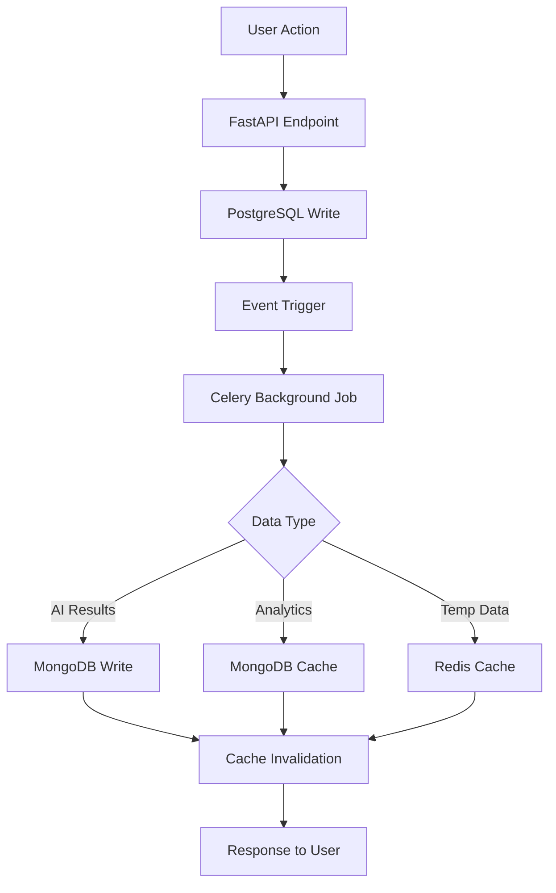
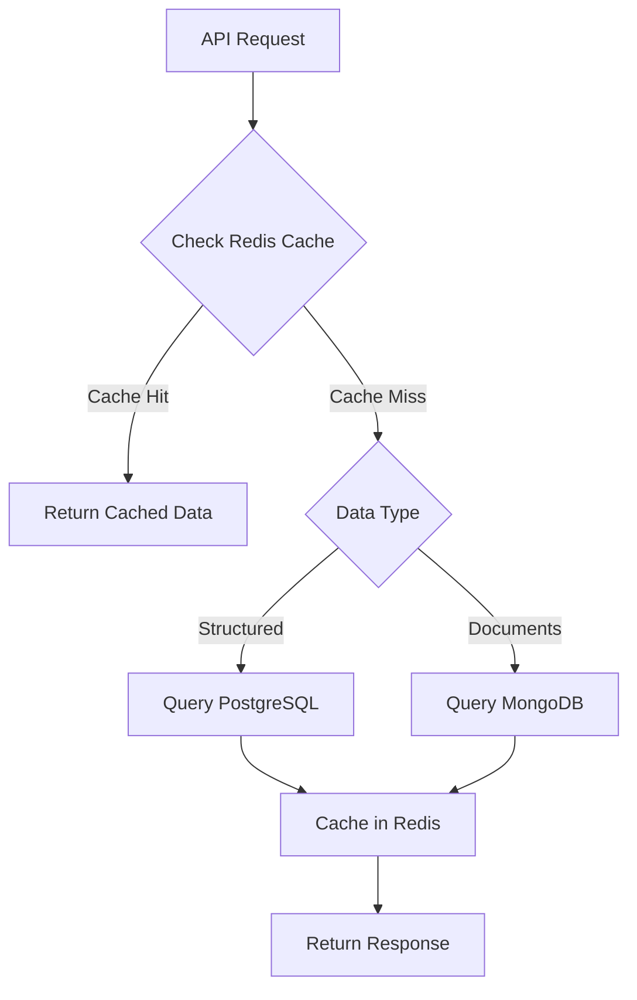

# Tender Insight Hub - Multi-Database Integration Plan

## Integration Overview

The Tender Insight Hub implements a sophisticated multi-database architecture that seamlessly integrates PostgreSQL (SQL), MongoDB (NoSQL), and Redis (caching) to optimize performance, scalability, and data consistency. This document outlines the comprehensive integration strategy, data flow patterns, and synchronization mechanisms.

## Database Roles and Responsibilities

### PostgreSQL - Primary Transactional Database
**Role**: Source of truth for structured, relational data requiring ACID compliance

**Data Responsibilities**:
- User accounts and authentication
- Team management and SaaS plan enforcement
- Company profiles and business information
- Tender metadata from OCDS API
- Workspace entries and status tracking
- Audit trails for critical operations

**Why PostgreSQL**:
- ACID compliance ensures data integrity for critical business operations
- Complex relational queries for reporting and analytics
- JSON field support for storing raw API responses
- Row-level security for multi-tenant data isolation
- Robust backup and recovery mechanisms

### MongoDB - Document Store for Flexible Data
**Role**: High-performance storage for semi-structured and variable-schema data

**Data Responsibilities**:
- AI-generated summaries and analysis results
- Readiness scores with complex nested criteria
- User activity logs with varying metadata
- Pre-computed analytics cache
- Search result caching with metadata

**Why MongoDB**:
- Schema flexibility adapts to evolving AI output formats
- High write throughput for logging and analytics
- Document-oriented structure natural fit for nested data
- Horizontal scaling capabilities for large datasets
- Efficient indexing for complex queries

### Redis - High-Speed Cache and Session Store
**Role**: In-memory caching for performance optimization and real-time data

**Data Responsibilities**:
- Search result caching (1-hour TTL)
- Rate limiting counters and quotas
- User session management
- Background job locks and coordination
- Pre-computed analytics for dashboards

**Why Redis**:
- Sub-millisecond access times for 100,000+ operations/second
- TTL support for automatic data expiration
- Atomic operations for accurate quota counting
- Pub/Sub for real-time notifications
- Persistence options for data durability

## Data Flow Architecture

### 1. Write Operations Flow



#### Example: New Tender Processing
```python
# 1. User saves tender to workspace
@router.post("/workspace/save")
async def save_tender(tender_data: TenderSave, user: User = Depends(get_current_user)):
    # Primary write to PostgreSQL (source of truth)
    workspace_entry = await db.execute("""
        INSERT INTO workspace_entries (team_id, tender_id, status, notes)
        VALUES (%s, %s, %s, %s) RETURNING entry_id
    """, (user.team_id, tender_data.tender_id, tender_data.status, tender_data.notes))
    
    # Trigger background processing
    await trigger_ai_processing.delay(tender_data.tender_id, user.team_id)
    
    return {"entry_id": workspace_entry.entry_id, "status": "saved"}

# 2. Background job processes AI analysis
@celery.task
async def trigger_ai_processing(tender_id: str, team_id: int):
    # Get tender details from PostgreSQL
    tender = await get_tender_details(tender_id)
    
    # Generate AI summary
    summary = await ai_summarizer.process(tender.description)
    
    # Store in MongoDB
    await mongo_db.tender_summaries.insert_one({
        "tender_id": tender_id,
        "summary": summary.text,
        "key_points": summary.key_points,
        "model_used": "facebook/bart-large-cnn",
        "created_at": datetime.utcnow()
    })
    
    # Calculate readiness score
    profile = await get_company_profile(team_id)
    score = calculate_readiness_score(profile, tender)
    
    # Store score in MongoDB
    await mongo_db.readiness_scores.replace_one(
        {"tender_id": tender_id, "team_id": team_id},
        {
            "tender_id": tender_id,
            "team_id": team_id,
            "score": score.overall_score,
            "checklist": score.checklist,
            "generated_at": datetime.utcnow()
        },
        upsert=True
    )
    
    # Invalidate related caches
    await redis.delete(f"team:{team_id}:workspace_cache")
    await redis.delete(f"tender:{tender_id}:summary_cache")
```

### 2. Read Operations Flow



#### Example: Workspace Dashboard Query
```python
@router.get("/workspace")
async def get_workspace(user: User = Depends(get_current_user)):
    cache_key = f"team:{user.team_id}:workspace_cache"
    
    # Try Redis cache first
    cached_data = await redis.get(cache_key)
    if cached_data:
        return json.loads(cached_data)
    
    # Query PostgreSQL for workspace entries
    entries = await db.execute("""
        SELECT we.*, t.title, t.deadline, t.budget, t.province
        FROM workspace_entries we
        JOIN tenders t ON we.tender_id = t.tender_id
        WHERE we.team_id = %s
        ORDER BY we.updated_at DESC
    """, (user.team_id,))
    
    # Enrich with MongoDB data
    for entry in entries:
        # Get AI summary
        summary = await mongo_db.tender_summaries.find_one(
            {"tender_id": entry.tender_id}
        )
        entry.summary = summary.get("summary") if summary else None
        
        # Get readiness score
        score = await mongo_db.readiness_scores.find_one({
            "tender_id": entry.tender_id,
            "team_id": user.team_id
        })
        entry.readiness_score = score.get("score") if score else None
    
    # Cache result for 30 minutes
    await redis.setex(cache_key, 1800, json.dumps(entries))
    
    return entries
```

## Data Synchronization Strategies

### 1. Event-Driven Synchronization

#### PostgreSQL Triggers
```sql
-- Trigger for tender updates
CREATE OR REPLACE FUNCTION notify_tender_change()
RETURNS TRIGGER AS $$
BEGIN
    -- Notify application of tender changes
    PERFORM pg_notify('tender_updated', NEW.tender_id);
    RETURN NEW;
END;
$$ LANGUAGE plpgsql;

CREATE TRIGGER tender_update_trigger
    AFTER INSERT OR UPDATE ON tenders
    FOR EACH ROW EXECUTE FUNCTION notify_tender_change();
```

#### Application Event Handlers
```python
import asyncio
import asyncpg

async def listen_for_tender_updates():
    conn = await asyncpg.connect(DATABASE_URL)
    
    async def handle_notification(connection, pid, channel, payload):
        tender_id = payload
        # Trigger AI reprocessing if needed
        await reprocess_tender.delay(tender_id)
        
        # Invalidate related caches
        await redis.delete_pattern(f"tender:{tender_id}:*")
    
    await conn.add_listener('tender_updated', handle_notification)
    
    # Keep connection alive
    while True:
        await asyncio.sleep(1)
```

### 2. Eventual Consistency Patterns

#### Write-Through Caching
```python
async def update_company_profile(team_id: int, profile_data: dict):
    # 1. Update PostgreSQL (source of truth)
    await db.execute("""
        UPDATE company_profiles 
        SET sector = %s, services = %s, updated_at = NOW()
        WHERE team_id = %s
    """, (profile_data.sector, profile_data.services, team_id))
    
    # 2. Invalidate cache immediately
    await redis.delete(f"team:{team_id}:profile_cache")
    
    # 3. Trigger score recalculation (async)
    await recalculate_all_scores.delay(team_id)
    
    # 4. Update search indexes (async)
    await update_search_index.delay(team_id)

@celery.task
async def recalculate_all_scores(team_id: int):
    # Get all team's workspace entries
    entries = await db.execute("""
        SELECT tender_id FROM workspace_entries WHERE team_id = %s
    """, (team_id,))
    
    # Recalculate each score
    for entry in entries:
        await calculate_and_store_score(entry.tender_id, team_id)
```

#### Read-Through Caching
```python
async def get_tender_with_analysis(tender_id: str, team_id: int):
    cache_key = f"tender:{tender_id}:team:{team_id}:full_data"
    
    # Try cache first
    cached = await redis.get(cache_key)
    if cached:
        return json.loads(cached)
    
    # Fetch from multiple sources
    tender_data = {}
    
    # PostgreSQL - basic tender info
    tender = await db.execute("""
        SELECT * FROM tenders WHERE tender_id = %s
    """, (tender_id,))
    tender_data.update(tender._asdict())
    
    # MongoDB - AI analysis
    summary = await mongo_db.tender_summaries.find_one(
        {"tender_id": tender_id}
    )
    if summary:
        tender_data["ai_summary"] = summary
    
    # MongoDB - readiness score
    score = await mongo_db.readiness_scores.find_one({
        "tender_id": tender_id,
        "team_id": team_id
    })
    if score:
        tender_data["readiness_assessment"] = score
    
    # Cache for 1 hour
    await redis.setex(cache_key, 3600, json.dumps(tender_data))
    
    return tender_data
```

### 3. Conflict Resolution Strategies

#### Last-Write-Wins (LWW)
```python
async def resolve_concurrent_updates(tender_id: str, updates: list):
    """Handle concurrent updates using timestamp-based resolution"""
    
    # Sort updates by timestamp
    sorted_updates = sorted(updates, key=lambda x: x.timestamp)
    latest_update = sorted_updates[-1]
    
    # Apply latest update to PostgreSQL
    await db.execute("""
        UPDATE tenders 
        SET title = %s, description = %s, last_updated = %s
        WHERE tender_id = %s AND last_updated < %s
    """, (
        latest_update.title,
        latest_update.description, 
        latest_update.timestamp,
        tender_id,
        latest_update.timestamp
    ))
    
    # Trigger re-analysis with latest data
    await reanalyze_tender.delay(tender_id)
```

#### Vector Clocks for Complex Conflicts
```python
class VectorClock:
    def __init__(self, node_id: str):
        self.node_id = node_id
        self.clock = {node_id: 0}
    
    def tick(self):
        self.clock[self.node_id] += 1
    
    def update(self, other_clock: dict):
        for node, timestamp in other_clock.items():
            self.clock[node] = max(self.clock.get(node, 0), timestamp)
        self.tick()

async def resolve_workspace_conflicts(entry_updates: list):
    """Resolve workspace entry conflicts using vector clocks"""
    
    for update in entry_updates:
        clock = VectorClock(update.node_id)
        clock.update(update.vector_clock)
        
        # Determine if update is concurrent or causal
        if is_concurrent(update.vector_clock, existing_clock):
            # Manual resolution needed
            await flag_for_manual_resolution(update)
        else:
            # Apply update
            await apply_workspace_update(update)
```

## Multi-Tenant Data Isolation

### 1. PostgreSQL Row-Level Security (RLS)

#### Policy Implementation
```sql
-- Enable RLS on tenant-specific tables
ALTER TABLE workspace_entries ENABLE ROW LEVEL SECURITY;
ALTER TABLE company_profiles ENABLE ROW LEVEL SECURITY;

-- Create security policies
CREATE POLICY tenant_isolation_workspace ON workspace_entries
    USING (team_id = current_setting('app.current_team_id')::INT);

CREATE POLICY tenant_isolation_profiles ON company_profiles  
    USING (team_id = current_setting('app.current_team_id')::INT);

-- Function to set tenant context
CREATE OR REPLACE FUNCTION set_tenant_context(p_team_id INT)
RETURNS VOID AS $$
BEGIN
    PERFORM set_config('app.current_team_id', p_team_id::TEXT, true);
END;
$$ LANGUAGE plpgsql;
```

#### Application Integration
```python
from contextlib import asynccontextmanager

@asynccontextmanager
async def tenant_context(team_id: int):
    """Context manager for tenant-isolated database operations"""
    conn = await db.acquire()
    try:
        # Set tenant context
        await conn.execute("SELECT set_tenant_context(%s)", team_id)
        yield conn
    finally:
        # Clear context
        await conn.execute("RESET app.current_team_id")
        await db.release(conn)

# Usage example
async def get_workspace_entries(team_id: int):
    async with tenant_context(team_id) as conn:
        # All queries automatically filtered by team_id
        return await conn.fetch("SELECT * FROM workspace_entries")
```

### 2. MongoDB Document-Level Isolation

#### Query Filtering
```python
class TenantAwareMongoClient:
    def __init__(self, db_client, team_id: int):
        self.db = db_client
        self.team_id = team_id
    
    async def find(self, collection: str, query: dict = None):
        """Automatically inject team_id filter"""
        query = query or {}
        query["team_id"] = self.team_id
        return await self.db[collection].find(query)
    
    async def find_one(self, collection: str, query: dict = None):
        """Find single document with tenant isolation"""
        query = query or {}
        query["team_id"] = self.team_id
        return await self.db[collection].find_one(query)
    
    async def insert_one(self, collection: str, document: dict):
        """Insert with automatic team_id injection"""
        document["team_id"] = self.team_id
        return await self.db[collection].insert_one(document)
    
    async def update_many(self, collection: str, filter_query: dict, update: dict):
        """Update with tenant isolation"""
        filter_query["team_id"] = self.team_id
        return await self.db[collection].update_many(filter_query, update)

# Usage in FastAPI dependency
async def get_tenant_mongo(user: User = Depends(get_current_user)) -> TenantAwareMongoClient:
    return TenantAwareMongoClient(mongo_db, user.team_id)

@router.get("/readiness-scores")
async def get_scores(mongo: TenantAwareMongoClient = Depends(get_tenant_mongo)):
    # Automatically filtered by team_id
    scores = await mongo.find("readiness_scores", {"score": {"$gte": 70}})
    return list(scores)
```

#### Index Optimization for Multi-Tenancy
```javascript
// Compound indexes with team_id as first field for optimal performance
db.readiness_scores.createIndex({
    "team_id": 1,
    "score": -1,
    "generated_at": -1
}, {
    name: "tenant_score_time_idx"
});

db.tender_summaries.createIndex({
    "team_id": 1,
    "tender_id": 1
}, {
    unique: true,
    name: "tenant_tender_unique_idx"
});

// Partial indexes for active data only
db.user_activity_logs.createIndex({
    "team_id": 1,
    "timestamp": -1
}, {
    partialFilterExpression: {
        "timestamp": {
            "$gte": new Date(Date.now() - 90 * 24 * 60 * 60 * 1000) // Last 90 days
        }
    },
    name: "recent_activity_idx"
});
```

### 3. Redis Namespace Isolation

#### Key Namespacing Strategy
```python
class TenantAwareRedisClient:
    def __init__(self, redis_client, team_id: int):
        self.redis = redis_client
        self.team_id = team_id
        self.namespace = f"team:{team_id}"
    
    def _key(self, key: str) -> str:
        """Generate namespaced key"""
        return f"{self.namespace}:{key}"
    
    async def get(self, key: str):
        return await self.redis.get(self._key(key))
    
    async def set(self, key: str, value, ex: int = None):
        return await self.redis.set(self._key(key), value, ex=ex)
    
    async def delete(self, key: str):
        return await self.redis.delete(self._key(key))
    
    async def delete_pattern(self, pattern: str):
        """Delete all keys matching pattern within tenant namespace"""
        full_pattern = self._key(pattern)
        keys = await self.redis.keys(full_pattern)
        if keys:
            return await self.redis.delete(*keys)
    
    async def incr(self, key: str):
        return await self.redis.incr(self._key(key))
    
    async def expire(self, key: str, seconds: int):
        return await self.redis.expire(self._key(key), seconds)

# Usage examples
async def track_search_quota(team_id: int):
    redis_client = TenantAwareRedisClient(redis, team_id)
    
    # Check current quota
    current = await redis_client.get("search_quota") or 0
    
    if int(current) >= get_search_limit(team_id):
        raise QuotaExceededException()
    
    # Increment quota
    await redis_client.incr("search_quota")
    
    # Set expiry for midnight reset
    midnight = get_next_midnight()
    await redis_client.expire("search_quota", midnight - time.time())
```

## Performance Optimization Strategies

### 1. Connection Pooling and Resource Management

#### PostgreSQL Connection Pool
```python
from sqlalchemy.pool import QueuePool
from sqlalchemy.ext.asyncio import create_async_engine

# Optimized connection pool configuration
engine = create_async_engine(
    DATABASE_URL,
    poolclass=QueuePool,
    pool_size=20,  # Base connections
    max_overflow=30,  # Additional connections under load
    pool_pre_ping=True,  # Validate connections
    pool_recycle=3600,  # Recycle connections every hour
    echo=False,  # Disable SQL logging in production
    connect_args={
        "server_settings": {
            "application_name": "tender_insight_api",
            "jit": "off",  # Disable JIT for consistent performance
        }
    }
)

# Connection health monitoring
@asynccontextmanager
async def get_db_connection():
    start_time = time.time()
    try:
        async with engine.begin() as conn:
            yield conn
    except Exception as e:
        # Log connection issues
        logger.error(f"Database connection error: {e}")
        raise
    finally:
        duration = time.time() - start_time
        if duration > 1.0:  # Log slow connections
            logger.warning(f"Slow database connection: {duration:.2f}s")
```

#### MongoDB Connection Optimization
```python
from motor.motor_asyncio import AsyncIOMotorClient

# MongoDB client with connection pooling
mongo_client = AsyncIOMotorClient(
    MONGODB_URL,
    maxPoolSize=50,  # Maximum connections
    minPoolSize=5,   # Minimum connections
    maxIdleTimeMS=30000,  # Close idle connections after 30s
    serverSelectionTimeoutMS=5000,  # 5s timeout for server selection
    socketTimeoutMS=20000,  # 20s socket timeout
    connectTimeoutMS=10000,  # 10s connection timeout
    retryWrites=True,  # Enable retryable writes
    retryReads=True,   # Enable retryable reads
    compressors="zstd,zlib,snappy"  # Enable compression
)

# Connection monitoring
async def monitor_mongo_health():
    try:
        # Ping the database
        await mongo_client.admin.command("ping")
        
        # Check connection pool stats
        pool_stats = await mongo_client.admin.command("connPoolStats")
        logger.info(f"MongoDB pool stats: {pool_stats}")
        
    except Exception as e:
        logger.error(f"MongoDB health check failed: {e}")
```

#### Redis Connection Management
```python
import redis.asyncio as redis
from redis.asyncio.connection import ConnectionPool

# Redis connection pool
redis_pool = ConnectionPool(
    host=REDIS_HOST,
    port=REDIS_PORT,
    db=0,
    max_connections=100,
    retry_on_timeout=True,
    socket_timeout=5,
    socket_connect_timeout=5,
    health_check_interval=30
)

redis_client = redis.Redis(connection_pool=redis_pool)

# Circuit breaker for Redis operations
class RedisCircuitBreaker:
    def __init__(self, failure_threshold=5, recovery_timeout=60):
        self.failure_threshold = failure_threshold
        self.recovery_timeout = recovery_timeout
        self.failure_count = 0
        self.last_failure_time = 0
        self.state = "CLOSED"  # CLOSED, OPEN, HALF_OPEN
    
    async def call(self, operation, *args, **kwargs):
        if self.state == "OPEN":
            if time.time() - self.last_failure_time > self.recovery_timeout:
                self.state = "HALF_OPEN"
            else:
                raise CircuitBreakerOpenException()
        
        try:
            result = await operation(*args, **kwargs)
            if self.state == "HALF_OPEN":
                self.state = "CLOSED"
                self.failure_count = 0
            return result
        except Exception as e:
            self.failure_count += 1
            self.last_failure_time = time.time()
            
            if self.failure_count >= self.failure_threshold:
                self.state = "OPEN"
            
            raise e

# Usage
redis_circuit_breaker = RedisCircuitBreaker()

async def cached_operation(key: str):
    try:
        return await redis_circuit_breaker.call(redis_client.get, key)
    except CircuitBreakerOpenException:
        # Fallback to database
        logger.warning("Redis circuit breaker open, falling back to database")
        return await get_from_database(key)
```

### 2. Query Optimization

#### PostgreSQL Query Optimization
```python
# Optimized queries with proper indexing
async def get_user_dashboard_data(team_id: int):
    """Efficient single query for dashboard data"""
    
    query = """
    WITH workspace_summary AS (
        SELECT 
            status,
            COUNT(*) as count,
            AVG(CASE WHEN rs.score IS NOT NULL THEN rs.score END) as avg_score
        FROM workspace_entries we
        LEFT JOIN readiness_scores rs ON we.tender_id = rs.tender_id AND rs.team_id = we.team_id
        WHERE we.team_id = $1
        GROUP BY status
    ),
    upcoming_deadlines AS (
        SELECT COUNT(*) as count
        FROM workspace_entries we
        JOIN tenders t ON we.tender_id = t.tender_id
        WHERE we.team_id = $1 
        AND t.deadline BETWEEN NOW() AND NOW() + INTERVAL '7 days'
        AND we.status IN ('Interested', 'Pending')
    )
    SELECT 
        json_build_object(
            'workspace_summary', json_agg(ws.*),
            'upcoming_deadlines', ud.count
        ) as dashboard_data
    FROM workspace_summary ws
    CROSS JOIN upcoming_deadlines ud
    """
    
    result = await db.fetchrow(query, team_id)
    return result['dashboard_data']

# Index supporting the query
"""
CREATE INDEX idx_workspace_team_status_score ON workspace_entries(team_id, status) 
    INCLUDE (tender_id);
CREATE INDEX idx_tenders_deadline_active ON tenders(deadline) 
    WHERE status = 'active' AND deadline > NOW();
"""
```

#### MongoDB Aggregation Optimization
```python
async def get_team_analytics(team_id: int, period_days: int = 30):
    """Optimized aggregation pipeline for team analytics"""
    
    cutoff_date = datetime.utcnow() - timedelta(days=period_days)
    
    pipeline = [
        # Match team and date range
        {
            "$match": {
                "team_id": team_id,
                "generated_at": {"$gte": cutoff_date}
            }
        },
        # Group by score ranges
        {
            "$bucket": {
                "groupBy": "$score",
                "boundaries": [0, 30, 50, 70, 85, 100],
                "default": "other",
                "output": {
                    "count": {"$sum": 1},
                    "avg_score": {"$avg": "$score"},
                    "tenders": {"$push": "$tender_id"}
                }
            }
        },
        # Add percentage calculations
        {
            "$addFields": {
                "percentage": {
                    "$multiply": [
                        {"$divide": ["$count", {"$sum": "$count"}]},
                        100
                    ]
                }
            }
        }
    ]
    
    # Use read preference for analytics queries
    result = await mongo_db.readiness_scores.aggregate(
        pipeline,
        allowDiskUse=True,  # Allow disk usage for large datasets
        readPreference="secondaryPreferred"  # Use secondary for analytics
    ).to_list(length=None)
    
    return result

# Supporting indexes
"""
db.readiness_scores.createIndex({
    "team_id": 1,
    "generated_at": -1,
    "score": 1
}, {
    name: "analytics_team_date_score_idx"
});
"""
```

### 3. Caching Strategies

#### Multi-Level Caching
```python
class MultiLevelCache:
    def __init__(self, redis_client, mongo_client):
        self.redis = redis_client  # L1 Cache (fastest)
        self.mongo = mongo_client  # L2 Cache (medium)
        # PostgreSQL is L3 (slowest, source of truth)
    
    async def get_tender_data(self, tender_id: str, team_id: int):
        # L1: Try Redis first (sub-millisecond)
        redis_key = f"tender:{tender_id}:team:{team_id}"
        cached = await self.redis.get(redis_key)
        if cached:
            return json.loads(cached)
        
        # L2: Try MongoDB cache (few milliseconds)
        mongo_cached = await self.mongo.cache_collection.find_one({
            "cache_key": redis_key,
            "expires_at": {"$gt": datetime.utcnow()}
        })
        
        if mongo_cached:
            # Restore to L1 cache
            await self.redis.setex(redis_key, 3600, json.dumps(mongo_cached['data']))
            return mongo_cached['data']
        
        # L3: Generate from source data (tens of milliseconds)
        data = await self._generate_tender_data(tender_id, team_id)
        
        # Cache in both levels
        await self._cache_data(redis_key, data)
        
        return data
    
    async def _cache_data(self, key: str, data: dict):
        # Cache in Redis (1 hour TTL)
        await self.redis.setex(key, 3600, json.dumps(data))
        
        # Cache in MongoDB (24 hour TTL) 
        await self.mongo.cache_collection.replace_one(
            {"cache_key": key},
            {
                "cache_key": key,
                "data": data,
                "created_at": datetime.utcnow(),
                "expires_at": datetime.utcnow() + timedelta(hours=24)
            },
            upsert=True
        )
```

#### Smart Cache Invalidation
```python
class SmartCacheInvalidator:
    def __init__(self, redis_client):
        self.redis = redis_client
        self.invalidation_patterns = {
            "tender_update": [
                "tender:{tender_id}:*",
                "team:*:workspace_cache",
                "search:*"
            ],
            "profile_update": [
                "team:{team_id}:*",
                "analytics:team:{team_id}:*"
            ],
            "workspace_change": [
                "team:{team_id}:workspace_cache",
                "team:{team_id}:dashboard_cache"
            ]
        }
    
    async def invalidate(self, event_type: str, **kwargs):
        """Intelligently invalidate related caches"""
        patterns = self.invalidation_patterns.get(event_type, [])
        
        for pattern in patterns:
            # Format pattern with provided kwargs
            formatted_pattern = pattern.format(**kwargs)
            
            # Find and delete matching keys
            keys = await self.redis.keys(formatted_pattern)
            if keys:
                await self.redis.delete(*keys)
                logger.info(f"Invalidated {len(keys)} cache keys for pattern: {formatted_pattern}")

# Usage in event handlers
cache_invalidator = SmartCacheInvalidator(redis)

@event_handler("tender_updated")
async def handle_tender_update(tender_id: str):
    await cache_invalidator.invalidate("tender_update", tender_id=tender_id)

@event_handler("profile_updated") 
async def handle_profile_update(team_id: int):
    await cache_invalidator.invalidate("profile_update", team_id=team_id)
    # Trigger score recalculation
    await recalculate_team_scores.delay(team_id)
```

## Error Handling and Recovery

### 1. Database Connection Recovery

#### PostgreSQL Recovery
```python
from sqlalchemy.exc import DisconnectionError
import asyncio

class DatabaseRecoveryManager:
    def __init__(self, engine, max_retries=3, backoff_factor=2):
        self.engine = engine
        self.max_retries = max_retries
        self.backoff_factor = backoff_factor
    
    async def execute_with_retry(self, query, *args):
        """Execute query with automatic retry on connection failure"""
        for attempt in range(self.max_retries):
            try:
                async with self.engine.begin() as conn:
                    return await conn.execute(query, *args)
            
            except DisconnectionError as e:
                if attempt == self.max_retries - 1:
                    logger.error(f"Database connection failed after {self.max_retries} attempts")
                    raise
                
                # Exponential backoff
                wait_time = self.backoff_factor ** attempt
                logger.warning(f"Database connection failed, retrying in {wait_time}s (attempt {attempt + 1})")
                await asyncio.sleep(wait_time)
                
                # Force connection pool refresh
                await self.engine.dispose()
            
            except Exception as e:
                logger.error(f"Non-recoverable database error: {e}")
                raise

# Global recovery manager
db_recovery = DatabaseRecoveryManager(engine)

# Usage in API endpoints
@router.get("/workspace")
async def get_workspace(user: User = Depends(get_current_user)):
    try:
        return await db_recovery.execute_with_retry(
            "SELECT * FROM workspace_entries WHERE team_id = %s",
            user.team_id
        )
    except Exception as e:
        # Fallback to cached data if available
        cached = await redis.get(f"team:{user.team_id}:workspace_emergency_cache")
        if cached:
            logger.warning("Using emergency cache due to database failure")
            return json.loads(cached)
        raise HTTPException(status_code=503, detail="Service temporarily unavailable")
```

#### MongoDB Replica Set Failover
```python
from pymongo.errors import AutoReconnect, ServerSelectionTimeoutError

class MongoFailoverHandler:
    def __init__(self, mongo_client):
        self.client = mongo_client
        self.db = mongo_client.tender_insight_db
    
    async def execute_with_failover(self, operation, *args, **kwargs):
        """Execute MongoDB operation with automatic failover handling"""
        max_retries = 3
        base_delay = 1
        
        for attempt in range(max_retries):
            try:
                return await operation(*args, **kwargs)
            
            except (AutoReconnect, ServerSelectionTimeoutError) as e:
                if attempt == max_retries - 1:
                    logger.error(f"MongoDB operation failed after {max_retries} attempts: {e}")
                    raise
                
                # Wait for replica set to elect new primary
                delay = base_delay * (2 ** attempt)
                logger.warning(f"MongoDB connection issue, retrying in {delay}s: {e}")
                await asyncio.sleep(delay)
            
            except Exception as e:
                logger.error(f"Non-recoverable MongoDB error: {e}")
                raise
    
    async def ensure_indexes(self):
        """Ensure indexes exist after failover"""
        try:
            # Check if indexes exist
            indexes = await self.db.readiness_scores.list_indexes().to_list(length=None)
            required_indexes = ["team_id_1_score_-1", "team_id_1_tender_id_1"]
            
            existing_names = [idx['name'] for idx in indexes]
            
            for required in required_indexes:
                if required not in existing_names:
                    logger.warning(f"Missing index {required}, recreating...")
                    await self._create_missing_indexes()
                    break
        
        except Exception as e:
            logger.error(f"Failed to verify indexes: {e}")

# Global failover handler
mongo_failover = MongoFailoverHandler(mongo_client)

# Health check with automatic recovery
@celery.task
async def mongodb_health_check():
    try:
        await mongo_client.admin.command("ping")
        await mongo_failover.ensure_indexes()
    except Exception as e:
        logger.error(f"MongoDB health check failed: {e}")
        # Trigger alert to operations team
        await send_alert("mongodb_health_failed", error=str(e))
```

### 2. Data Consistency Checks

#### Cross-Database Validation
```python
class DataConsistencyChecker:
    def __init__(self, pg_db, mongo_db, redis_client):
        self.pg_db = pg_db
        self.mongo_db = mongo_db
        self.redis = redis_client
    
    async def check_tender_consistency(self, tender_id: str):
        """Verify data consistency across databases"""
        issues = []
        
        # Check PostgreSQL tender exists
        pg_tender = await self.pg_db.fetchrow(
            "SELECT tender_id, title, last_updated FROM tenders WHERE tender_id = $1",
            tender_id
        )
        
        if not pg_tender:
            issues.append(f"Tender {tender_id} not found in PostgreSQL")
            return issues
        
        # Check MongoDB summary exists
        mongo_summary = await self.mongo_db.tender_summaries.find_one(
            {"tender_id": tender_id}
        )
        
        if not mongo_summary:
            issues.append(f"Summary missing in MongoDB for tender {tender_id}")
        else:
            # Check if summary is newer than tender
            if mongo_summary['created_at'] < pg_tender['last_updated']:
                issues.append(f"Summary outdated for tender {tender_id}")
        
        # Check cache consistency
        cached_data = await self.redis.get(f"tender:{tender_id}:metadata")
        if cached_data:
            cached = json.loads(cached_data)
            if cached.get('title') != pg_tender['title']:
                issues.append(f"Cache outdated for tender {tender_id}")
        
        return issues
    
    async def repair_inconsistencies(self, tender_id: str, issues: list):
        """Attempt to repair found inconsistencies"""
        for issue in issues:
            if "Summary missing" in issue:
                await self._regenerate_summary(tender_id)
            elif "Summary outdated" in issue:
                await self._regenerate_summary(tender_id)
            elif "Cache outdated" in issue:
                await self.redis.delete(f"tender:{tender_id}:*")
        
        logger.info(f"Repaired {len(issues)} inconsistencies for tender {tender_id}")

# Automated consistency checking
@celery.task
async def daily_consistency_check():
    """Daily automated consistency check"""
    checker = DataConsistencyChecker(db, mongo_db, redis)
    
    # Check recent tenders
    recent_tenders = await db.fetch("""
        SELECT tender_id FROM tenders 
        WHERE last_updated > NOW() - INTERVAL '24 hours'
    """)
    
    total_issues = 0
    for tender in recent_tenders:
        issues = await checker.check_tender_consistency(tender['tender_id'])
        if issues:
            total_issues += len(issues)
            await checker.repair_inconsistencies(tender['tender_id'], issues)
    
    logger.info(f"Daily consistency check completed. Found and repaired {total_issues} issues.")
```

## Monitoring and Observability

### 1. Database Performance Monitoring

#### Real-time Metrics Collection
```python
import time
from contextlib import asynccontextmanager

class DatabaseMetrics:
    def __init__(self):
        self.query_times = []
        self.connection_pool_stats = {}
        self.error_counts = {}
    
    @asynccontextmanager
    async def track_query(self, query_type: str, database: str):
        start_time = time.time()
        try:
            yield
        except Exception as e:
            # Track errors
            error_key = f"{database}_{type(e).__name__}"
            self.error_counts[error_key] = self.error_counts.get(error_key, 0) + 1
            raise
        finally:
            # Track timing
            duration = time.time() - start_time
            self.query_times.append({
                "query_type": query_type,
                "database": database,
                "duration": duration,
                "timestamp": time.time()
            })
    
    async def get_performance_summary(self):
        """Get performance metrics summary"""
        recent_queries = [
            q for q in self.query_times 
            if time.time() - q["timestamp"] < 3600  # Last hour
        ]
        
        if not recent_queries:
            return {"status": "no_recent_queries"}
        
        # Calculate percentiles
        durations = [q["duration"] for q in recent_queries]
        durations.sort()
        
        return {
            "total_queries": len(recent_queries),
            "avg_duration": sum(durations) / len(durations),
            "p50_duration": durations[len(durations) // 2],
            "p95_duration": durations[int(len(durations) * 0.95)],
            "p99_duration": durations[int(len(durations) * 0.99)],
            "error_counts": self.error_counts.copy(),
            "slow_queries": [q for q in recent_queries if q["duration"] > 1.0]
        }

# Global metrics collector
db_metrics = DatabaseMetrics()

# Usage in database operations
async def get_workspace_with_metrics(team_id: int):
    async with db_metrics.track_query("workspace_select", "postgresql"):
        return await db.fetch(
            "SELECT * FROM workspace_entries WHERE team_id = $1",
            team_id
        )
```

#### Health Check Endpoints
```python
@router.get("/health/databases")
async def database_health_check():
    """Comprehensive database health check"""
    health_status = {
        "timestamp": datetime.utcnow().isoformat(),
        "overall_status": "healthy"
    }
    
    # PostgreSQL health
    try:
        async with db_metrics.track_query("health_check", "postgresql"):
            start_time = time.time()
            await db.execute("SELECT 1")
            pg_latency = (time.time() - start_time) * 1000
        
        health_status["postgresql"] = {
            "status": "healthy",
            "latency_ms": round(pg_latency, 2),
            "pool_size": engine.pool.size(),
            "checked_out": engine.pool.checkedout()
        }
    except Exception as e:
        health_status["postgresql"] = {
            "status": "unhealthy",
            "error": str(e)
        }
        health_status["overall_status"] = "degraded"
    
    # MongoDB health
    try:
        start_time = time.time()
        await mongo_client.admin.command("ping")
        mongo_latency = (time.time() - start_time) * 1000
        
        # Get replica set status
        rs_status = await mongo_client.admin.command("replSetGetStatus")
        primary_node = next(
            (member for member in rs_status["members"] if member["stateStr"] == "PRIMARY"),
            None
        )
        
        health_status["mongodb"] = {
            "status": "healthy",
            "latency_ms": round(mongo_latency, 2),
            "replica_set": rs_status["set"],
            "primary_node": primary_node["name"] if primary_node else "unknown"
        }
    except Exception as e:
        health_status["mongodb"] = {
            "status": "unhealthy", 
            "error": str(e)
        }
        health_status["overall_status"] = "degraded"
    
    # Redis health
    try:
        start_time = time.time()
        await redis.ping()
        redis_latency = (time.time() - start_time) * 1000
        
        info = await redis.info()
        health_status["redis"] = {
            "status": "healthy",
            "latency_ms": round(redis_latency, 2),
            "memory_usage": info["used_memory_human"],
            "connected_clients": info["connected_clients"]
        }
    except Exception as e:
        health_status["redis"] = {
            "status": "unhealthy",
            "error": str(e)
        }
        health_status["overall_status"] = "degraded"
    
    # Performance metrics
    health_status["performance"] = await db_metrics.get_performance_summary()
    
    return health_status
```

This comprehensive integration plan provides a robust foundation for managing the complex multi-database architecture of the Tender Insight Hub, ensuring high performance, data consistency, and operational reliability while supporting the platform's sophisticated feature set.
